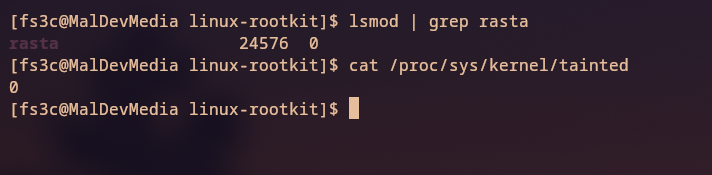
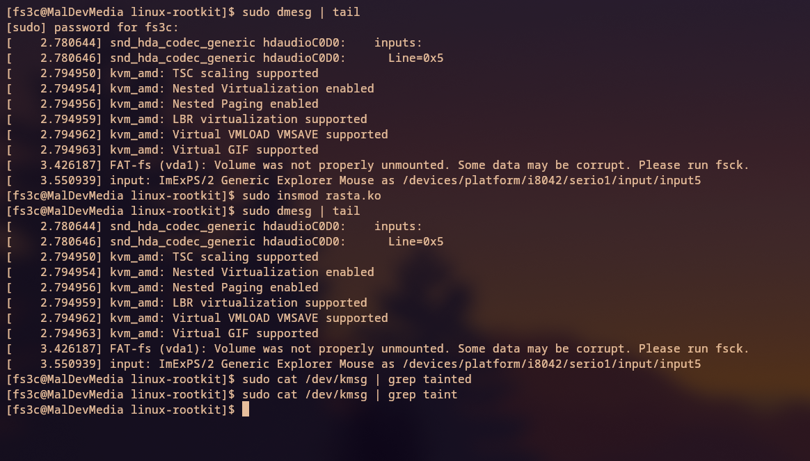
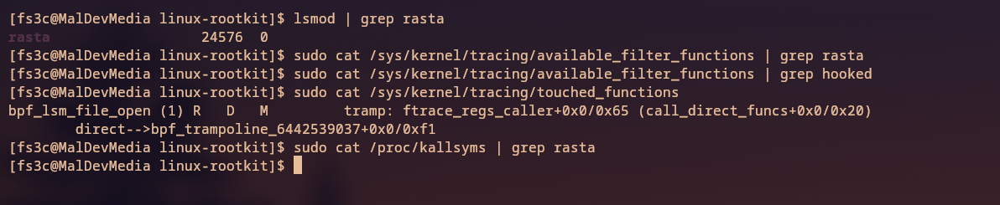
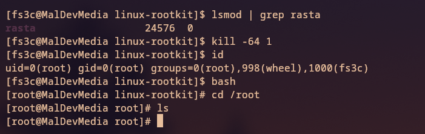
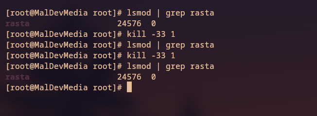
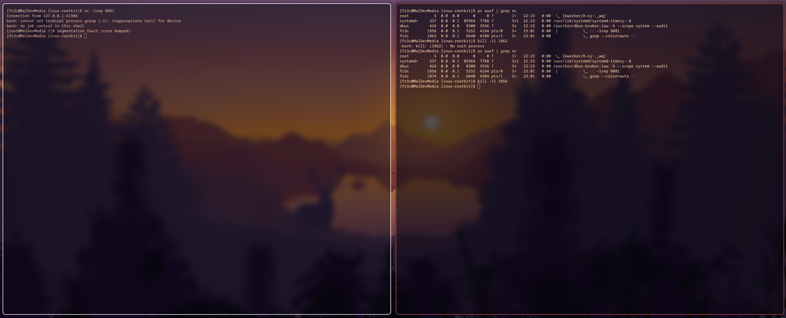
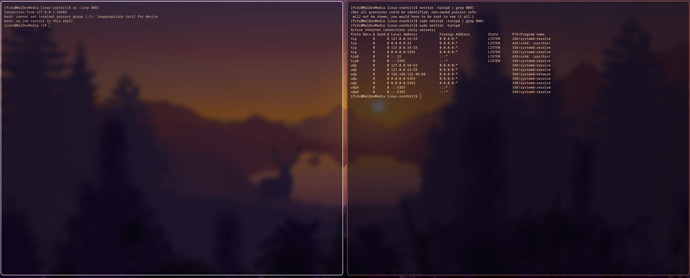

# RastaMon Linux Rootkit

*Simple POC of a Linux kernel module posing as a rootkit to stealthily hook its syscalls and leave no trace!*

## Core Capabilities

Rasta has the following capabilities:

* Hide every file/directory with the name `rasta` from userspace with a `getdents64` hook.
* Remove/Add the module from the `/proc/modules` list.
* Gain root capabilities by using the `hooked_kill` syscall and setting all IDs to 0.
* Hide `taint` message from `dmesg` or `/dev/kmsg`.
* Hide from `/sys/module` without deleting the module from the directory (explained below, with examples).
* `hooked_read` will filter out all lines with the word `rasta` (the module name we want to hide).
   * Hides all the module's functions from `/sys/kernel/tracing/touched_functions` and `/proc/kallsyms`.

## Examples

### Resetting the taint_mask to 0

* This demonstrates how Rasta manipulates the kernel's taint mask, effectively resetting it to 0 and hiding the taint messages that would normally indicate kernel module loading issues.

---

### Hiding `taint` from `/dev/kmsg`

* Here, the `taint` message is hidden from `/dev/kmsg`, meaning any errors or warnings about the module loading won’t appear in the kernel log.

---

### Hiding All of Our Functions from `/proc/kallsyms` and `/sys/kernel/tracing/touched_functions`

* The `hooked_read` function is used to hide Rasta's functions from `/proc/kallsyms` and `/sys/kernel/tracing/touched_functions`. This ensures that the functions used by Rasta are never exposed to user space.

---

### Setting All IDs to 0

* By using the `hooked_kill` syscall, Rasta sets all process IDs (UIDs, GIDs, etc.) to 0, effectively giving the kernel module root privileges.

---

### Adding/Removing the Module from the `/proc/modules` List

* This shows how Rasta can add or remove itself from the `/proc/modules` list. The module can be removed to hide its presence from userspace, while still being active in the kernel.

---

### Hiding Everything Named `rasta`

* The `getdents64` hook hides all files and directories named `rasta` from userspace. This is a stealth technique to ensure that the module’s presence is not detected through file listings or directory searches.

* **Note**: Technically, we don’t need to delete the module from `/sys/module/` because it won’t show up in directory listings due to the `getdents64` hook. While the directory is still there, it is hidden from userspace, making it hard to detect.

---

### Hiding Processes' PIDs

* The `getdents64` and `kill` hooks are also used to hide the process IDs (PIDs) of userspace processes. Currently, there are some issues with completely hiding PIDs, but SIGKILL is sent to the process.

---

### Hiding TCP Connections on Port 8081

* One of the key features of Rasta is the ability to **hide network connections**. Specifically, we hook into two critical APIs: `tcp4_seq_show` and `tcp6_seq_show` using **ftrace**. These two functions are responsible for displaying information about IPv4 and IPv6 TCP connections in userspace.

* By intercepting these calls, Rasta can **hide** any active TCP connections on port 8081 from tools like `netstat` or `ss`. This ensures that network activity, such as reverse shells or other types of communication using port 8081, remains invisible to standard network monitoring tools.

* The core mechanism works by:
   1. **Hooking** the `tcp4_seq_show` and `tcp6_seq_show` functions.
   2. **Filtering out any connection** on port 8081 (or any other port you wish to target) from being listed.
   3. This method provides a stealthy way to maintain network communications without detection.

---

### Reverse Shell

* This is a simple reverse shell that listens for connections on `localhost`. The IP address can be easily changed in `kprobe/rev-shell.h` to connect to an external host.
* The reverse shell utilizes the **hidden network connection** on port 8081, which is stealthed by Rasta's ftrace hook, allowing for covert communication.

---

## Extra

> [!Important]  
> Not responsible for anything done with this. If you're dumb enough to think this is FUD malware, just go away. 😑

### Resources:

* [Linux Rootkit Series by fs3cs0ciety](https://github.com/fs3cs0ciety/Linux-Rootkit-Series)
* [Rootkit by matheuZSecurity](https://github.com/matheuZSecurity/Rootkit)
* [Xcellerator's blog](https://xcellerator.github.io/)
* [The Linux Kernel Source](https://github.com/torvalds/linux)

### Arch Setup (if you're wondering):

* [Dotfiles by mylinuxforwork](https://github.com/mylinuxforwork/dotfiles)
